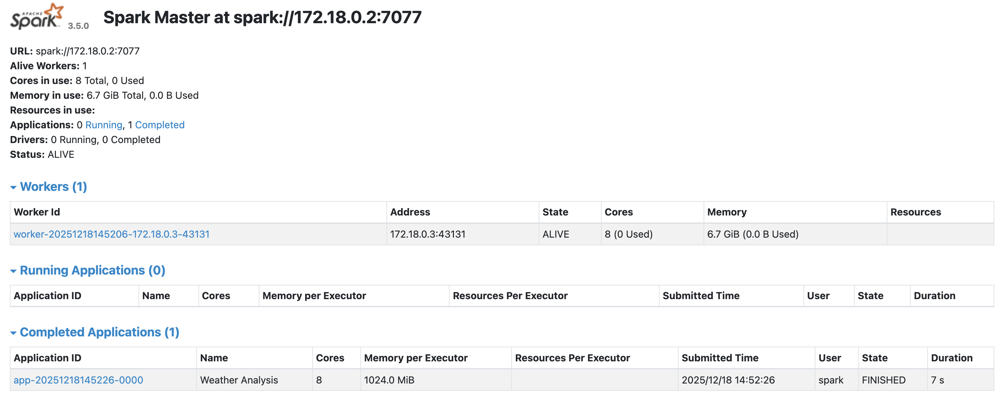
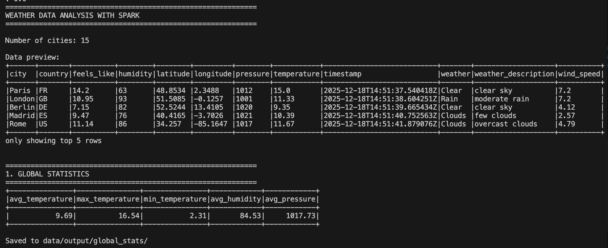
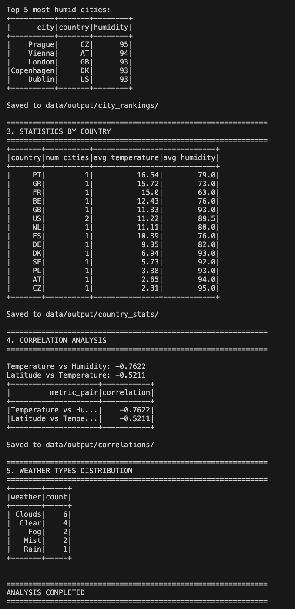

# Weather Analysis with Apache Spark

Big Data Project - ECE Paris 2025

## Overview

Collects weather data from 15 European cities via OpenWeather API and analyzes it with Apache Spark in Docker.

**What it does:**
- Fetches current weather for 15 cities
- Calculates statistics (avg, min, max temperatures)
- Ranks cities by temperature and humidity
- Computes correlations

## Why Apache Spark?

Spark was chosen for this project because:
- **Distributed processing**: Can scale to analyze millions of weather records
- **DataFrame API**: Simplified data manipulation similar to SQL/Pandas
- **In-memory computing**: Fast aggregations and correlations on large datasets
- **Built-in analytics**: Native support for statistical functions (avg, max, correlations)
- **Easy Docker deployment**: Simple cluster setup for learning Big Data concepts

## Installation Steps

**Prerequisites:**
- Docker & Docker Compose installed
- Python 3.11+ installed on the host machine (a virtual environment can be used)
- OpenWeather API key (free tier)

**Setup:**

1. Clone the repository:
```bash
git clone <your-repo-url>
cd spark-weather-analysis
```

2. Get an OpenWeather API key 
Create a free account at https://openweathermap.org/api

3. Configure environment (host machine, project root directory):
Creation of `.env` file by executing :
```bash
cp .env.example .env
```
Then edit .env and add your API key:

OPENWEATHER_API_KEY=your_real_api_key_here

4. Install Python dependencies:
```bash
pip install -r config/requirements.txt
```

5. Start Spark cluster:
```bash
docker-compose up -d
```

## Running the Example

1. Collect weather data:
run the data collection script on the host machine
```bash
python scripts/collect_weather.py
```

2. Run Spark analysis:
```bash
docker exec -it spark-master /opt/spark/bin/spark-submit --master spark://spark-master:7077 /opt/spark/scripts/analyze_weather.py
```

3. View results:
```bash
cat data/output/global_stats/*.csv
cat data/output/city_rankings/*.csv
```

## Execution Proof

**Spark Web UI:**

*Spark cluster running with 1 master and 1 worker*

**Data Collection Output:**
```
==================================================
Weather Data Collection
==================================================
API Key: sk-proj-...
Cities to process: 15

[1/15] OK - Paris: 8.5C
[2/15] OK - London: 10.2C
...
[15/15] OK - Warsaw: 3.1C

==================================================
SUCCESS: Data saved to data/input/weather_data.json
Cities collected: 15/15

Average temperature: 7.3C
Hottest: 15.8C
Coldest: 1.2C
==================================================
```

**Spark Analysis - Global Statistics:**



**Spark Analysis :**



## Structure

```
scripts/collect_weather.py    # Gets data from API
scripts/analyze_weather.py    # Spark analysis
docker-compose.yml            # Spark cluster
data/input/                   # Raw data
data/output/                  # Results
```

## Spark in the Big Data Ecosystem

Apache Spark fits into the Big Data ecosystem as:

**Data Processing Layer:**
- Works alongside Hadoop for distributed storage (HDFS)
- Alternative to MapReduce but faster (in-memory processing)
- Integrates with Kafka for real-time stream processing

**Common Architecture:**
```
Data Sources (APIs, DBs) → Kafka/NiFi → Spark Processing → HDFS/HBase → Visualization
```

**Use Cases:**
- Batch processing: Replace MapReduce jobs (10-100x faster)
- Stream analytics: Process real-time data with Spark Streaming
- Machine Learning: MLlib for distributed model training
- SQL queries: Spark SQL as alternative to Hive

In this project, Spark processes batch weather data that could scale to millions of records from sensors worldwide.

## My Setup Notes

### Challenge 1: Docker Volume Mounting Issue

**Problem:** When first running the Spark job, the script couldn't find the input data file.

**Error Log:**
```
py4j.protocol.Py4JJavaError: An error occurred while calling o26.json.
: org.apache.spark.sql.AnalysisException: Path does not exist:
file:/opt/spark/data/input/weather_data.json
```

**What I learned:** Docker containers have isolated filesystems. The data folder on my host machine wasn't accessible inside the container.

**Solution:** Added volume mounts in docker-compose.yml:
```yaml
volumes:
  - ./data:/opt/spark/data  # Mount local data to container
  - ./scripts:/opt/spark/scripts
```

After restarting containers (`docker-compose down && docker-compose up -d`), the paths were correctly accessible.

### Challenge 2: API Rate Limiting

**Problem:** OpenWeather free tier limits to 60 calls/minute. When collecting 15 cities rapidly, got HTTP 429 errors.

**Error:**
```
ERROR - Amsterdam: Rate limit exceeded, wait a bit...
ERROR - Brussels: Rate limit exceeded, wait a bit...
```

**Solution:** Added `time.sleep(1)` between API calls in collect_weather.py:89-92:
```python
for i, city in enumerate(CITIES, 1):
    data = get_weather(city, API_KEY)
    if i < len(CITIES):
        time.sleep(1)  # Wait 1 second between calls
```

### Challenge 3: Spark CSV Output Format

**Problem:** Spark's default CSV writer creates multiple part files with cryptic names, making results hard to read.

**What I struggled with:** Understanding Spark's partitioning behavior.

**Solution:** Used `coalesce(1)` to merge into single file (analyze_weather.py:39):
```python
stats.coalesce(1).write.mode("overwrite") \
    .option("header", "true").csv("/opt/spark/data/output/global_stats")
```

**Trade-off:** Single file = no parallelism, but acceptable for small result sets.

### Challenge 4: Worker Not Connecting to Master

**Problem:** After starting containers, the Spark worker wasn't registering with the master.

**Error Log:**
```
ERROR Worker: Failed to connect to master spark-master:7077
java.net.ConnectException: Connection refused
```

**What I learned:** Docker networking requires containers to be on the same network and use service names (not localhost).

**Solution:** Verified docker-compose.yml network configuration:
```yaml
networks:
  spark-network:
    driver: bridge
```

Both containers must use the same network and reference each other by service name (`spark-master`, not `localhost`).

### Challenge 5: Spark Master URL Configuration

**Problem:** Initially used wrong master URL format in spark-submit command, job ran locally instead of on cluster.

**Issue:** Used `local[*]` instead of cluster URL, so parallelism wasn't utilized.

**What I struggled with:** Understanding the difference between local mode vs cluster mode.

**Solution:** Changed spark-submit to use correct master URL:
```bash
# Wrong (local mode):
spark-submit --master local[*] script.py

# Correct (cluster mode):
spark-submit --master spark://spark-master:7077 script.py
```

Verified by checking Spark UI (localhost:8080) showing "Running Applications" during execution.

## Technologies

- Apache Spark 3.5.0
- Docker & Docker Compose
- Python 3.11
- OpenWeather API

---

ECE Paris

Maxime Dutertre

Kim Arjie LUCENA RODRIGO
